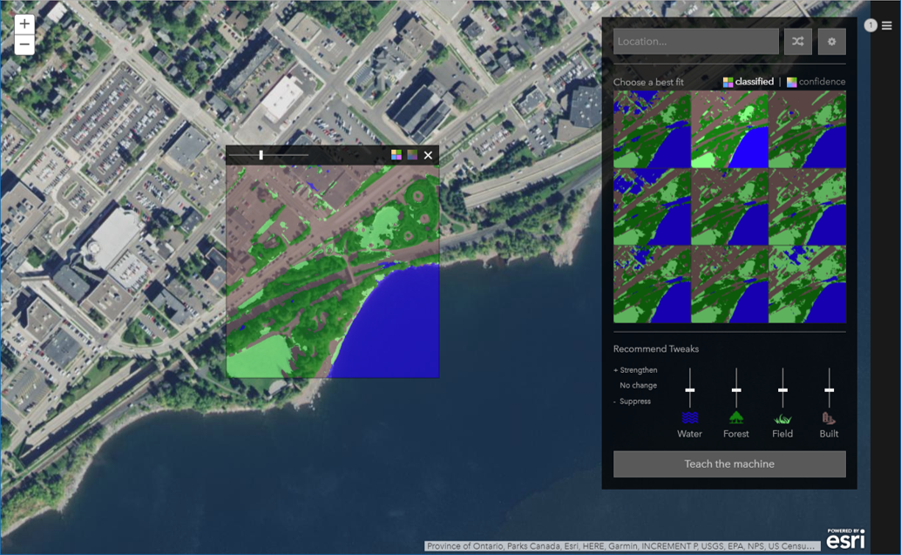

# Land Cover Classification App

This [web mapping application](https://vannizhang.github.io/aiforearth-landcover-app/build/#) provides users a tool to visualize, test and tune the pixel level land cover classification from a [deep neural network model](https://blogs.technet.microsoft.com/machinelearning/2018/03/12/pixel-level-land-cover-classification-using-the-geo-ai-data-science-virtual-machine-and-batch-ai/) using the [Cognitive Toolkit (CNTK)](https://www.microsoft.com/en-us/cognitive-toolkit/), [Azure Geo AI Data Science Virtual Machine](http://aka.ms/dsvm/GeoAI) or an [Azure Batch AI](https://docs.microsoft.com/azure/batch-ai/). The model was developed in collaboration between the [Chesapeake Conservancy](http://chesapeakeconservancy.org/), [ESRI](https://www.esri.com), and [Microsoft Research](https://www.microsoft.com/research/) as part of Microsoft's [AI for Earth](https://www.microsoft.com/en-us/aiforearth) initiative.

[View it live](https://vannizhang.github.io/aiforearth-landcover-app/build/#)



## How it works

- Click anywhere on the map to load 9 training tile candidates, click the training tile candidates to show it in the area selection panel on map, adjust the opcity to see how it compares to the natural color high resolution aerial imagery.
- The user may push land cover type sliders up and down to get adjusted results.
- Click "Teach the machine" button to submit the selected training tile candidate that will be used to train the model.
- Click the menu button at top right to open a collection of submitted training tiles. A training tile can be selected to open the application to that current state for editing.


## Prerequisites
Before we begin, make sure you have a fresh version of [Node.js](https://nodejs.org/en/) installed. The current Long Term Support (LTS) release is an ideal starting point. 

## Installing 
To begin, clone this repository to your computer:

```sh
https://github.com/vannizhang/aiforearth-landcover-app.git
```

From the project's root directory, install the required packages (dependencies):

```sh
npm install
```

## Running the app 
Now you can start the webpack dev server to test the app on your local machine:

```sh
# it will start a server instance and begin listening for connections from localhost on port 8080
npm run server
```

## Deployment
To build/deploye the app, you can simply run:

```sh
# it will place all files needed for deployment into the /build directory 
npm run build
```

## External Libraries:
- [ArcGIS API for JavaScript (3.2)](https://developers.arcgis.com/javascript/3/)
- [tiff.js](https://github.com/seikichi/tiff.js) 
- [jQuery](https://github.com/jquery/jquery)


## Resources
- [AI for Earth](https://www.microsoft.com/en-us/aiforearth)
- [Pixel-level land classification tutorial](https://github.com/Azure/pixel_level_land_classification)
- [Geo AI Data Science VM with ArcGIS](https://azuremarketplace.microsoft.com/en-us/marketplace/apps/microsoft-ads.geodsvm?tab=Overview)
- [Esri](https://www.esri.com/en-us/home)


## Issues

Find a bug or want to request a new feature?  Please let us know by submitting an issue.

## Contributing

Esri welcomes contributions from anyone and everyone. Please see our [guidelines for contributing](https://github.com/esri/contributing).

## Licensing
Copyright 2016 Esri

Licensed under the Apache License, Version 2.0 (the "License");
you may not use this file except in compliance with the License.
You may obtain a copy of the License at

   http://www.apache.org/licenses/LICENSE-2.0

Unless required by applicable law or agreed to in writing, software
distributed under the License is distributed on an "AS IS" BASIS,
WITHOUT WARRANTIES OR CONDITIONS OF ANY KIND, either express or implied.
See the License for the specific language governing permissions and
limitations under the License.

A copy of the license is available in the repository's [license.txt](license.txt) file.